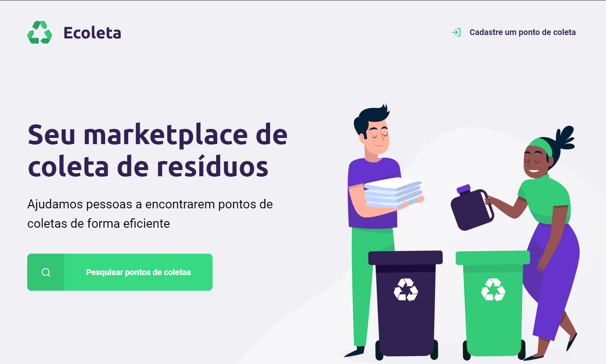
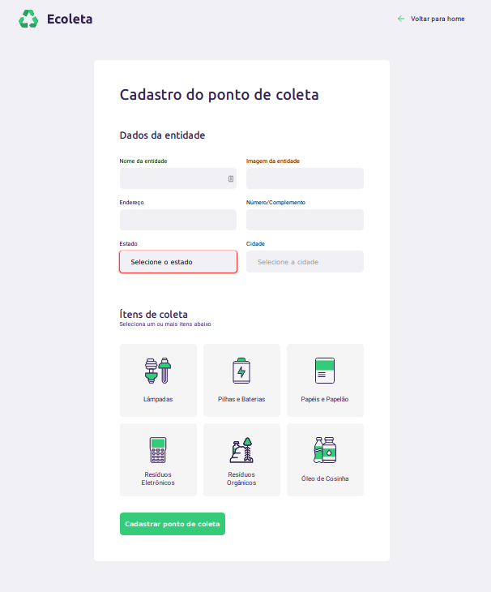
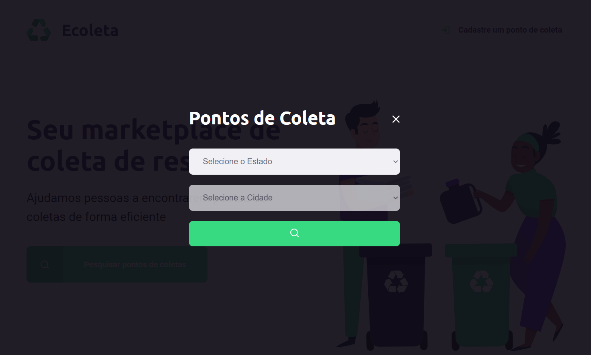
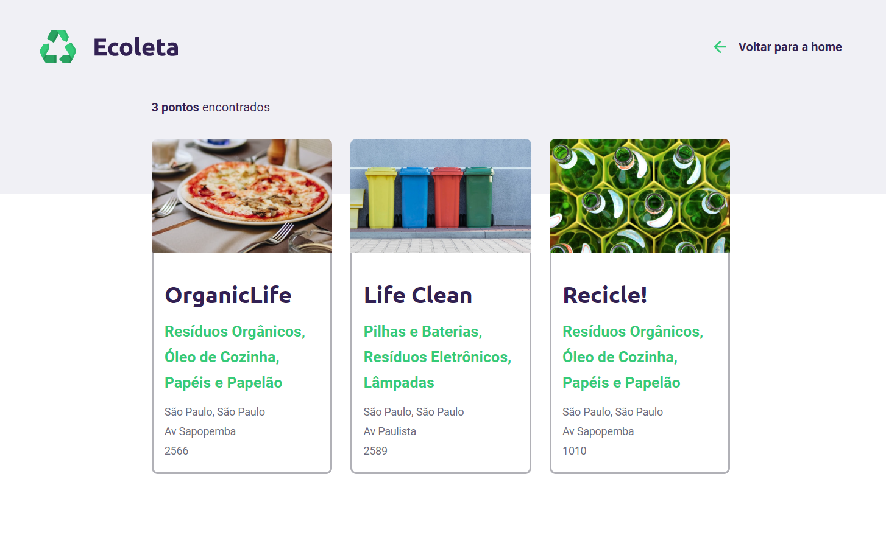

# Next Level Week - Ecoleta

## About the project

---

Ecoleta is a simple marketplace of waste collection. The idea behind the application is basically connect people with a business take away the garbage.

## Screenshots

---

## Getting Started

---

    # Install dependencies
    $ npm install
    # Start Project
    $ npm start
    # You can see the application on localhost link http://localhost:3000/

## Technologies

---

- [Node.js](https://nodejs.org/)
- [Express](https://expressjs.com/)
- [SQLite3](https://www.sqlite.org/index.html)
- [HTML](https://developer.mozilla.org/en-US/docs/Web/HTML)
- [CSS](https://developer.mozilla.org/en-US/docs/Web/CSS)
- [JavaScript](https://developer.mozilla.org/en-US/docs/Web/JavaScript)
- [Nunjucks](https://mozilla.github.io/nunjucks/)
